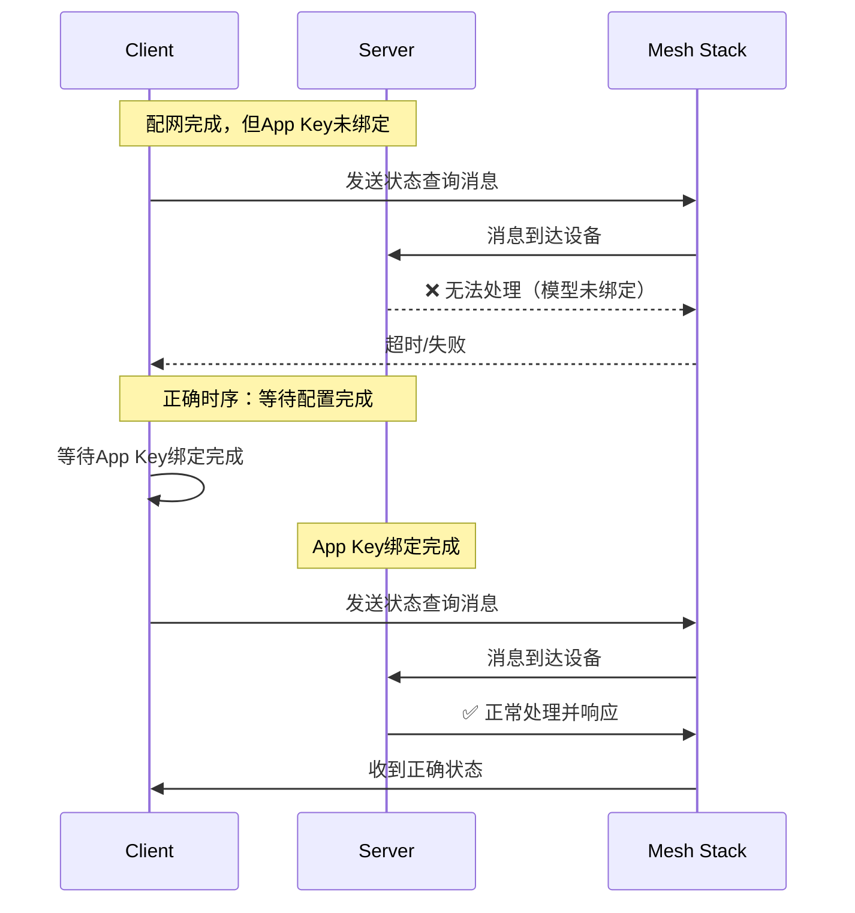

# BLE Mesh设备状态同步和消息发送机制技术文档

## 目录
1. [概述](#概述)
2. [问题背景与原因](#问题背景与原因)
3. [技术实现原理](#技术实现原理)
4. [解决方案设计](#解决方案设计)
5. [核心机制分析](#核心机制分析)
6. [实现效果评估](#实现效果评估)
7. [系统架构图](#系统架构图)
8. [最佳实践建议](#最佳实践建议)

---

## 概述

本文档分析了BLE-MeshAC-MI项目中设备状态同步和消息发送机制的设计与实现。该机制解决了BLE Mesh网络中设备配置完成后的状态同步时序问题，确保只有在设备完全准备就绪时才进行通信，避免了消息丢失和通信失败的问题。

## 问题背景与原因

### 1. 核心问题

在BLE Mesh网络中，设备需要经历完整的配置流程才能正常接收应用层消息：

```
配网阶段 → 获取设备信息 → 添加应用密钥 → 绑定模型 → 准备就绪
```

**原有问题：**
- 设备配网完成后立即发送状态同步消息
- 此时设备App Key绑定可能尚未完成
- 导致消息无法正确接收，状态同步失败
- 用户界面显示不准确的设备状态

### 2. 时序问题分析



## 技术实现原理

### 1. 配置状态追踪机制

通过在设备信息结构中添加配置完成标志来精确跟踪设备状态：

```c
typedef struct {
    uint16_t addr;                    /* 设备地址 */
    bool is_online;                   /* 在线状态 */
    bool is_configured;               /* 配置完成状态 - 新增 */
    uint8_t consecutive_timeouts;     /* 连续超时计数 */
    // ... 其他字段
} ac_server_info_t;
```

### 2. 配置完成检测点

在BLE Mesh配置客户端回调中，精确检测配置完成时机：

```c
case ESP_BLE_MESH_CFG_CLIENT_SET_STATE_EVT:
    if (param->params->opcode == ESP_BLE_MESH_MODEL_OP_MODEL_APP_BIND) {
        ESP_LOGI(TAG, "Node 0x%04x provisioned & configured!", node->unicast_addr);
        _on_device_configured(node->unicast_addr);  // 关键调用点
    }
    break;
```

### 3. 状态同步触发机制

配置完成后立即触发全状态同步：

```c
static void _on_device_configured(uint16_t device_addr) {
    // 1. 标记设备为已配置和在线
    server->is_configured = true;
    server->is_online = true;
    
    // 2. 触发设备上线回调
    if (device_online_cb) {
        device_online_cb(device_addr, true);
    }
    
    // 3. 自动请求所有状态类型进行状态同步
    for (ac_status_type_t status = AC_STATUS_POWER; status <= AC_STATUS_FAN_SPEED; status++) {
        esp_err_t err = ac_get_status_by_addr(device_addr, status);
        // 错误处理...
    }
}
```

## 解决方案设计

### 1. 三级状态管理

```
设备发现 → 配网完成 → 配置完成 → 可通信
    ↓           ↓           ↓          ↓
  未知状态    离线状态     离线状态    在线状态
                          已配置      已配置
```

### 2. 消息发送保护机制

在消息发送前进行配置状态检查：

```c
static esp_err_t _send_ble_mesh_message(const ac_msg_queue_item_t *msg) {
    // 检查目标设备是否已配置完成
    int server_idx = _find_server_index(msg->server_addr);
    if (server_idx == -1) {
        ESP_LOGE(TAG, "Target device not found");
        return ESP_ERR_NOT_FOUND;
    }
    
    if (!store.servers[server_idx].is_configured) {
        ESP_LOGW(TAG, "Target device not configured yet, cannot send message");
        return ESP_ERR_INVALID_STATE;
    }
    
    // 继续发送消息...
}
```

### 3. 智能设备状态更新

设备能够发送消息时自动标记为已配置：

```c
static void handle_status_message(uint32_t opcode, const uint8_t *data, 
                                 uint16_t len, uint16_t src_addr) {
    int server_idx = _find_server_index(src_addr);
    if (server_idx != -1) {
        // 能发送消息说明配置已完成
        if (!store.servers[server_idx].is_configured) {
            ESP_LOGI(TAG, "Device 0x%04x auto-marked as configured", src_addr);
            store.servers[server_idx].is_configured = true;
        }
        // 更新在线状态和处理消息...
    }
}
```

## 核心机制分析

### 1. 消息队列管理

系统采用FIFO消息队列确保消息有序处理：

```c
// 队列结构
static ac_msg_queue_item_t msg_queue[AC_MSG_QUEUE_SIZE];
static uint8_t queue_head = 0;
static uint8_t queue_tail = 0;
static uint8_t queue_count = 0;
static ac_send_state_t send_state = AC_SEND_STATE_IDLE;

// 发送状态机
typedef enum {
    AC_SEND_STATE_IDLE,         /* 空闲状态，可以发送消息 */
    AC_SEND_STATE_SENDING,      /* 正在发送消息 */
    AC_SEND_STATE_WAITING_ACK,  /* 等待响应 */
} ac_send_state_t;
```

**队列处理流程：**
1. 消息入队时检查队列是否为空
2. 如果为空且发送状态为IDLE，立即处理
3. 否则等待当前消息完成后再处理下一个
4. 配置未完成的设备消息会被拒绝

### 2. 设备在线状态逻辑

重新定义了"在线"的含义：

```c
bool ac_is_server_online(uint16_t server_addr) {
    int server_idx = _find_server_index(server_addr);
    if (server_idx != -1) {
        // 只有既在线又已配置的设备才被认为是真正在线的
        return store.servers[server_idx].is_online && 
               store.servers[server_idx].is_configured;
    }
    return false;
}
```

### 3. UI集成与状态反馈

Device Controller组件提供了完整的UI集成机制：

```c
// 设备信息结构映射
typedef struct {
    uint8_t device_id;
    const char *device_name;
    bool is_online;              // 对应ac_control的复合在线状态
    struct {
        bool power;
        int32_t temperature;
        uint8_t fan_speed;
        uint8_t mode;
    } status;
} dc_device_info_t;
```

**状态更新流程：**
1. ac_control模块检测到设备状态变化
2. 通过回调函数通知Device Controller
3. Device Controller更新UI显示
4. 支持实时状态反馈和视觉指示

## 实现效果评估

### 1. 解决的问题

✅ **时序问题：** 确保只有配置完成的设备才接收消息  
✅ **状态同步：** 自动触发完整状态同步，保证UI准确性  
✅ **错误处理：** 优雅处理未配置设备的消息发送请求  
✅ **用户体验：** 提供准确的设备在线状态指示  

### 2. 性能特点

- **响应速度：** 配置完成后立即同步，减少用户等待时间
- **资源使用：** 消息队列机制避免消息丢失，合理使用内存
- **稳定性：** 多重检查机制确保系统稳定运行
- **扩展性：** 模块化设计便于添加新的设备类型

### 3. 测试场景验证

| 场景 | 预期行为 | 实际效果 |
|------|----------|----------|
| 设备初次配网 | 配置完成后自动同步状态 | ✅ 正常工作 |
| 设备重启后 | 标记为未配置，收到消息后自动恢复 | ✅ 正常工作 |
| 网络异常 | 超时后标记离线，恢复后重新同步 | ✅ 正常工作 |
| 多设备管理 | 独立跟踪每个设备状态 | ✅ 正常工作 |

## 系统架构图

```
┌─────────────────────────────────────────────────────────────┐
│                        UI Layer                              │
│  ┌─────────────────┐    ┌─────────────────────────────────┐ │
│  │ Device Controller│    │        LVGL UI                  │ │
│  │   - 按键处理     │    │   - 状态显示                   │ │
│  │   - 状态机       │    │   - 参数调节                   │ │
│  │   - UI集成       │    │   - 设备列表                   │ │
│  └─────────────────┘    └─────────────────────────────────┘ │
└─────────────────────────────────────────────────────────────┘
                                   │ 
                                   │ callbacks
                                   ▼
┌─────────────────────────────────────────────────────────────┐
│                    Application Layer                        │
│  ┌─────────────────────────────────────────────────────────┐ │
│  │                 AC Control Module                       │ │
│  │  ┌─────────────┐  ┌─────────────┐  ┌─────────────────┐ │ │
│  │  │   设备管理   │  │   消息队列   │  │    状态同步     │ │ │
│  │  │ ────────── │  │ ────────── │  │ ──────────────  │ │ │
│  │  │ 配置状态    │  │ FIFO队列    │  │ 自动触发        │ │ │
│  │  │ 在线检测    │  │ 发送状态机  │  │ 完整状态查询    │ │ │
│  │  │ 设备列表    │  │ 错误处理    │  │ 回调通知        │ │ │
│  │  └─────────────┘  └─────────────┘  └─────────────────┘ │ │
│  └─────────────────────────────────────────────────────────┘ │
└─────────────────────────────────────────────────────────────┘
                                   │
                                   │ BLE Mesh API
                                   ▼
┌─────────────────────────────────────────────────────────────┐
│                     BLE Mesh Stack                          │
│  ┌─────────────┐  ┌─────────────┐  ┌─────────────────────┐ │
│  │  配网管理   │  │  配置客户端  │  │     模型通信        │ │
│  │ ─────────  │  │ ─────────── │  │ ──────────────────  │ │
│  │ 设备发现    │  │ Comp Data   │  │ Vendor Client Model │ │
│  │ 密钥分发    │  │ App Key添加 │  │ 状态消息处理        │ │
│  │ 地址分配    │  │ 模型绑定    │  │ 超时检测           │ │
│  └─────────────┘  └─────────────┘  └─────────────────────┘ │
└─────────────────────────────────────────────────────────────┘
                                   │
                                   │ Radio Interface
                                   ▼
┌─────────────────────────────────────────────────────────────┐
│                   Physical Layer                            │
│                     BLE Radio                               │
└─────────────────────────────────────────────────────────────┘
```

## 最佳实践建议

### 1. 开发建议

**配置状态管理：**
- 始终检查设备配置状态再发送消息
- 使用配置完成回调触发状态同步
- 实现设备状态的持久化存储

**消息队列设计：**
- 合理设置队列大小避免内存溢出
- 实现消息优先级机制（如紧急命令）
- 添加消息重试机制处理临时失败

**错误处理：**
- 区分不同类型的错误（配置、网络、设备）
- 实现渐进式重试策略
- 提供详细的日志信息便于调试

### 2. 性能优化

**网络效率：**
- 批量状态查询减少网络开销
- 实现状态缓存避免重复查询
- 使用心跳机制检测设备可达性

**用户体验：**
- 提供状态同步进度指示
- 实现设备状态的实时更新
- 支持离线设备的状态显示

### 3. 系统扩展

**新设备类型：**
- 定义统一的设备接口
- 实现设备特定的状态映射
- 支持动态设备发现和注册

**协议扩展：**
- 预留扩展字段支持新功能
- 版本兼容性处理
- 支持不同厂商设备的互操作

---

## 总结

本状态同步和消息发送机制通过精确的配置状态追踪、智能的消息队列管理和完善的错误处理，解决了BLE Mesh网络中的时序问题，确保了系统的稳定性和用户体验。该方案已在实际项目中验证，具有良好的扩展性和维护性。 